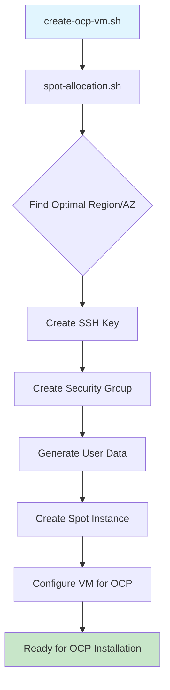

# OpenShift Container Platform VM Creator

An intelligent AWS spot instance provisioning tool specifically designed for OpenShift Container Platform (OCP) deployments. This script integrates with the existing spot allocation logic to create optimally priced VMs ready for OCP installation.

## Features

- **Intelligent Spot Allocation**: Uses the existing `spot-allocation.sh` to find the best AWS region/AZ combination
- **OCP-Optimized Configuration**: Pre-configured with appropriate resource sizing for different OCP deployment types
- **Automated Infrastructure Setup**: Creates security groups, SSH keys, and proper networking automatically
- **RHEL Compatibility**: Automatically selects compatible RHEL AMIs based on OCP version
- **Cost Optimization**: Leverages spot pricing to save 50-90% compared to on-demand instances
- **Ready-to-Use VMs**: Includes pre-installed OCP prerequisites and preparation scripts

## Prerequisites

```bash
# Install required tools
sudo apt-get install -y awscli jq bc

# Configure AWS credentials
aws configure
```

## Quick Start

```bash
# Make scripts executable
chmod +x create-ocp-vm.sh test-ocp-vm.sh

# Create a single node OpenShift 4.14 VM
./create-ocp-vm.sh -v 4.14 -s single

# Test the functionality (runs without creating AWS resources)
./test-ocp-vm.sh
```

## Usage

### Basic Syntax

```bash
./create-ocp-vm.sh -v <OCP_VERSION>  [OPTIONS]
```

### Required Parameters

| Parameter | Description | Example |
|-----------|-------------|---------|
| `-v, --ocp-version` | OpenShift version | `4.14`, `4.15`, `4.16` |
| `-s, --cluster-size` | Deployment type | `single`, `compact`, `standard`, `large` |

### Optional Parameters

| Parameter | Description | Default | Example |
|-----------|-------------|---------|---------|
| `-n, --vm-name` | VM name prefix | `ocp` | `my-cluster` |
| `-k, --key-name` | SSH key pair name | `ocp-key` | `my-ocp-key` |
| `-t, --instance-types` | Override instance types | Auto-detected | `m5.large,c5.large` |
| `-r, --increase-rate` | Spot price buffer % | `10` | `20` |
| `--volume-size` | Root volume size (GB) | `120` | `150` |
| `--volume-type` | EBS volume type | `gp3` | `gp2` |
| `-d, --debug` | Enable debug output | Off | N/A |

## Examples

### Single Node OpenShift (Development)

```bash
# Basic single node setup
./create-ocp-vm.sh -v 4.14 -s single

# With custom name and larger disk
./create-ocp-vm.sh -v 4.14 -s single -n dev-ocp --volume-size 200
```

### Compact Cluster (Small Production)

```bash
# 3-node cluster setup
./create-ocp-vm.sh -v 4.15 -s compact -n prod-ocp

# With specific instance types and higher spot bid
./create-ocp-vm.sh -v 4.15 -s compact -t "m5.xlarge,c5.xlarge" -r 25
```

### Standard Cluster (Production Workers)

```bash
# Standard worker nodes
./create-ocp-vm.sh -v 4.16 -s standard -n worker-nodes

# Custom configuration with specific key
./create-ocp-vm.sh -v 4.16 -s standard -n worker-nodes -k production-key
```

### Large Cluster (High Performance)

```bash
# High-performance nodes
./create-ocp-vm.sh -v 4.14 -s large -n compute-nodes --volume-size 250
```

## Output

The script provides structured JSON output with connection details:

```json
{
  "instance_id": "i-0123456789abcdef0",
  "public_ip": "54.123.45.67",
  "region": "us-west-2",
  "availability_zone": "us-west-2a", 
  "instance_type": "m5.xlarge",
  "spot_price": 0.0584,
  "vm_name": "ocp",
  "ssh_command": "ssh -i ~/.ssh/ocp-key.pem core@54.123.45.67",
  "key_file": "~/.ssh/ocp-key.pem"
}
```

## Post-Creation Steps

### 1. Connect to VM

```bash
# SSH to the VM (command provided in output)
ssh -i ~/.ssh/ocp-key.pem core@<PUBLIC_IP>
```

### 2. Prepare for OCP Installation

```bash
# Run the preparation script
/opt/ocp/prepare-install.sh
```

### 3. Install OpenShift

The VM comes pre-configured with:
- ✅ RHEL system updated
- ✅ Container runtime (Podman) installed
- ✅ OpenShift CLI (`oc` and `kubectl`) installed
- ✅ Firewall configured for OCP ports
- ✅ SELinux configured appropriately
- ✅ System services configured
- ✅ User `core` created with sudo access

You can now proceed with your OCP installation method of choice:
- OpenShift Installer
- Assisted Installer
- Agent-based Installer
- Manual installation

## Architecture



## Automated Infrastructure

The script automatically creates and configures:

### Security Groups
- SSH access (port 22)
- OCP API server (port 6443)
- HTTPS/Console (port 443)
- HTTP (port 80)
- Router ports (8080, 30000-32767)
- Internal cluster communication (2379-2380, 10250)

### SSH Key Management
- Creates new key pairs if they don't exist
- Saves private key to `~/.ssh/<key-name>.pem`
- Sets proper permissions (600)

### VM Configuration
- RHEL-based AMI compatible with OCP version
- Encrypted EBS volumes
- Monitoring enabled
- Proper instance tagging

## Cost Optimization

- **Spot Pricing**: Saves 50-90% compared to on-demand
- **Global Analysis**: Finds cheapest regions automatically
- **Right-Sizing**: Matches instance types to OCP requirements
- **Intelligent Bidding**: Applies safety margins to reduce termination risk

## Testing

Run the comprehensive test suite:

```bash
./test-ocp-vm.sh
```

The test validates:
- ✅ Function logic and parameter handling
- ✅ JSON processing and data validation
- ✅ Integration with spot allocation script
- ✅ Security group configurations
- ✅ OCP version compatibility matrix
- ✅ User data script generation
- ✅ Command line argument parsing

## Troubleshooting

### Common Issues

**1. AWS CLI Not Configured**
```bash
aws configure
# or
export AWS_PROFILE=myprofile
```

**2. Spot Request Failed**
- Try increasing the bid rate: `-r 20`
- Check if instance types are available in target region
- Verify AMI compatibility

**3. SSH Connection Issues**
- Ensure key file permissions: `chmod 600 ~/.ssh/key.pem`
- Check security group rules
- Verify public IP assignment

**4. OCP Installation Prerequisites**
```bash
# Check VM is ready
ssh core@<ip> 'sudo systemctl status ocp-installer'

# Verify OCP tools
ssh core@<ip> 'oc version'
```

### Debug Mode

Enable detailed logging:

```bash
./create-ocp-vm.sh -v 4.14 -s single -d
```

## Integration with CI/CD

Example Jenkins/GitHub Actions usage:

```bash
# Environment setup
export AWS_PROFILE=cicd-profile
export CLUSTER_NAME="ci-ocp-${BUILD_NUMBER}"

# Create VM
./create-ocp-vm.sh \
  -v 4.14 \
  -s single \
  -n "$CLUSTER_NAME" \
  -k "ci-key" \
  -r 30

# Extract connection details
VM_IP=$(jq -r '.public_ip' vm-result.json)
ssh -i ~/.ssh/ci-key.pem core@$VM_IP '/opt/ocp/prepare-install.sh'
```

## Files Created

| File | Purpose |
|------|---------|
| `create-ocp-vm.sh` | Main VM creation script |
| `test-ocp-vm.sh` | Comprehensive test suite |
| `README-OCP-VM.md` | This documentation |

## OpenShift Version Support

| OCP Version | RHEL Version | Status |
|-------------|--------------|---------|
| 4.16.x | RHEL 9 | ✅ Supported |
| 4.15.x | RHEL 9 | ✅ Supported |
| 4.14.x | RHEL 9 | ✅ Supported |
| 4.13.x | RHEL 8 | ✅ Supported |
| 4.12.x | RHEL 8 | ✅ Supported |
| 4.11.x | RHEL 8 | ✅ Supported |
| 4.10.x | RHEL 8 | ✅ Supported |

## License

This script builds upon the existing spot allocation logic and maintains compatibility with the parent project's licensing terms.
